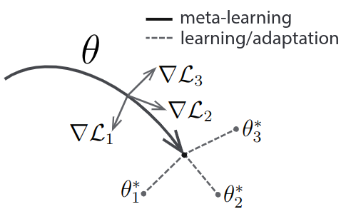

# Meta-Learning

## Overview
Prior meta-learning methods - train a meta-learner that learns how to update the parameters of the core learner's model.
With gradient (or optimization) based meta-learning, meta-parameters are learned in an `outer loop`, while task-specific models are learned in the `inner loop`.

## [Learning a synaptic learning rule](https://mila.quebec/wp-content/uploads/2019/08/bengio_1991_ijcnn.pdf)

- Consider the idea of synaptic modification rule as a parametric function.
- Joint global optimization $(a)$ the synaptic modification function and $(b)$ the network that are learning to do stuff.

## [Model-Agnostic Meta-Learning for Fast Adaptation of Deep Networks](https://arxiv.org/abs/1703.03400)

### Notes
- The model parameters are explicitly trained such that a small number of gradient steps with a small amount of training data from a new task will give good generalization.
- Building internal representation that is broadly suitable for many tasks, fine-tuning the parameters slightly, gives good performance.
- Maximizing the sensitivity of the loss functions of new tasks with respect to the parameters. When the sensitivity is high, small local changes to the parameters can lead to large improvements.

 

- Consider a distribution over tasks $p(\tau)$, you train from samples drawn from $\tau_i$ but you also test on new samples - the test error serves as the training error of the meta-learning process.
- The meta-gradient update involves a gradient through a gradient. Computationally, this requires an additional backward pass through $f$ to compute the Hessian-vector products.
- MAML learner's weights are updated using the gradient, as opposed to using a learned update (this means that we do not need additional parameters for meta-learning)

Maths
- You go through each task $\tau_i$, the model's parameters $\theta$ become $\theta_i'$.

- $\theta_i'$ = $\theta$ - $\alpha \bigtriangledown_{\theta} \mathcal{L}(f_{\theta})$
- The model parameters are trained by optimizing for the performance of $f_{\theta'_i}$ w.r.t. $\theta$ across tasks.
- Meta-optimization is performed over the model parameters $\theta$, whereas the objective is computed using the updated model parameters $\theta'_i$.
- Meta-objective : $\min_{\theta}$ $\sum_{\tau_i \sim p(\tau)}$ $\mathcal{L_{\tau_i}(f_{\theta'_i})}$
- Meta-optimization: $\theta \leftarrow$ $\theta -$ $\beta \bigtriangledown_{\theta}$ $\sum_{\tau_i \sim p(\tau)}$ $\mathcal{L_{\tau_i}(f_{\theta'_i})}$

## [Meta-Gradient Reinforcement Learning](https://arxiv.org/abs/1805.09801)

### Notes
- The discount factor $\lambda$ determines the time-scale of the return. $\lambda=1$ provides a long-sighted goal that accumulates rewards far into the future, $\lambda=0$ provides a short-sighted goal prioritising short-term rewards.
- The return may also be bootstrapped at different time horizons. An $n$ step return accumulates rewards over $n$ time-steps and then adds the value function at the $n$th returns.
- Together these two trade-off bias and variance.
- Learn meta-parameters of a return function
- Using a differentiable `meta-objective`
- The meta-parameters `eta` being optimized, may be viewed as gates that cause the return to 
  - terminate (γ= 0)
  - bootstrap (λ= 0),
  - or to continue onto the next step (γ= 1 and λ= 1).
### Meta-Gradients to Returns
- Define $g_{\eta}(\tau_t) = R_{t+1} + \gamma R_{t+2} + \gamma^2 R_{t+3}, ..., + \gamma^{n-1} R_{t+n} + \gamma^n v_{\theta}(S_{t+n})$
- $\eta =\{\gamma, n\}$
- Define $g_{\eta}(\tau_t) = R_{t+1} + \gamma (1 - \lambda) v_{\theta}(S_{t+1}) + \gamma \lambda_{g_{\eta}}(\tau_{t+1})$
    - $\lambda-$return is a geometric mixture of $n-$step returns

## [Meta-Learning with Implicit Gradients](https://arxiv.org/pdf/1909.04630.pdf)

### Notes
- When we talk about meta-learning, we talk about higher-order derivatives which always imposes a non-trivial computational and memory burden. It can also suffer from vanishing gradients.
- Model-parameter -> {$\phi_i$}, meta-parameters -> ($\theta$)
- This paper is `implicit` MAML, optimization-based meta-learning to avoid differentiating through the optimization path.
- Think, task-specific parameters using a set of meta-parameters $\theta \in \Theta \equiv \mathcal{R}^d$. Goal is to learn meta-parameters that produce good task specific parameters *after* adaptation.
- This is also referred to as bi-level optimization, because the underlying optimization problem is done either explicitly or implicitly.
- The meta-learned parameter ($\theta^{*}_{ML}$) has a learned inductive bias that is particularly well-suited for fine-tuning on tasks from $P(\tau)$.
- To solve the outer-level problem with gradient-based methods, we need to differentiate through the inner level, this corresponds to *backpropagation through dynamics of gradient descent*.
- Proximal regularization, encourages $\phi_i$ to stay close to ($\theta$), to show dependence.
- Basic calculus : $d$ denotes the total derivative and $	\bigtriangledown$ to denote partial derivative.
- There's an important distinction between $d_{\theta} \ell_i(Alg_{i}(\theta))$ and $\bigtriangledown_{\phi}\ell_i (Alg_{i}(\theta))$. The former passes derivatives through $Alg_{i}(\theta)$ while the latter does not. $\bigtriangledown_{\phi}\ell_i (Alg_{i}(\theta))$ is the gradient function ... So $\bigtriangledown_{\phi}\ell_i (\phi)$, evaluated at $\phi = Alg_{i}(\theta)$.
- 

